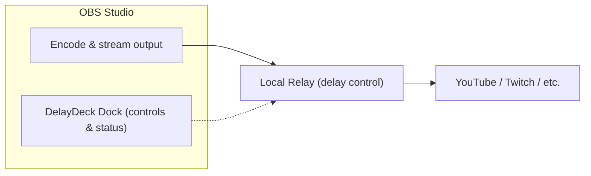

<div align="center">

# DelayDeck

**An OBS Studio plugin that toggles stream delay on and off while you are live**

<br>


<sub>DelayDeck Dock — delay controls, status, and destination setup · <a href="https://x.com/KatoJunta/status/2064341479984947235">Demo video (screen recording)</a></sub>

<br>

[日本語 README](README.md)

<br>

[](https://github.com/KatoJunta/DelayDeck/stargazers)
[](https://github.com/KatoJunta/DelayDeck/releases/latest)
[](https://github.com/KatoJunta/DelayDeck/releases)
[](LICENSE)

<br>

[**Download**](https://github.com/KatoJunta/DelayDeck/releases)
&nbsp;·&nbsp;
<a href="https://x.com/KatoJunta/status/2064341479984947235">Demo video</a>
&nbsp;·&nbsp;
<a href="#install">Install (ZIP)</a>
&nbsp;·&nbsp;
<a href="#build">Build</a>
&nbsp;·&nbsp;
<a href="#faq">FAQ</a>
&nbsp;·&nbsp;
<a href="#roadmap">Roadmap</a>

</div>

<br>

**DelayDeck** is a plugin and Relay Engine that makes OBS Studio’s built-in stream delay more flexible to use.

When streaming real-time competitive games with no broadcast delay, streamers can be put at a disadvantage by malicious stream snipers and people attempting to ghost. OBS’s built-in stream delay cannot be toggled on or off during a stream, so streamers had to choose between prioritizing in-game performance or engaging with their audience.

DelayDeck provides a way to **toggle delay on or off without stopping your stream**, so you can enjoy both the game and interaction with your viewers.

## 🧩 Components

DelayDeck consists of two parts:

| Component                          | Role                                                                              |
| ---------------------------------- | --------------------------------------------------------------------------------- |
| **DelayDeck for OBS** (OBS plugin) | Dock UI inside OBS, Relay startup/monitoring, destination setup, preflight checks |
| **DelayDeck Relay** (relay engine) | Ingest from OBS, delay buffer, output to your streaming platform                  |

In normal use, Relay starts automatically when OBS starts. You do not need to launch Relay manually.



### ✨ Main features

| Feature                    | Description                                                                    |
| -------------------------- | ------------------------------------------------------------------------------ |
| 🔄 **Delay on/off**        | Switch between realtime and delayed streaming mid-broadcast                    |
| 🖼️ **Slate scenes**        | Viewer-facing screens during delay transitions and return-to-live              |
| ⏩ **Return to Live Now**  | Discard unsent content and return to live (Dump Buffer, confirmation required) |
| ✅ **Preflight checks**    | Validate Relay, destination, and slate setup before going live                 |
| 🎯 **Destination presets** | Quick RTMP setup for YouTube, Twitch, and other platforms                      |

## 💻 Requirements

| Item         | Details                                                                           |
| ------------ | --------------------------------------------------------------------------------- |
| OS           | Windows 10 / 11 (64-bit)                                                          |
| OBS Studio   | **30.2.3**, **31.1.2**, or **32.1.2** (each build targets a specific OBS version) |
| Architecture | x64                                                                               |

> [!WARNING]
> The plugin may fail to load if your OBS version does not match the release build. **Always download the ZIP that matches your installed OBS version.**

After a new OBS major release, matching builds may take manual work. If the version you need is not on the Releases page, contact us on [X (@KatoJunta)](https://x.com/KatoJunta) or via [GitHub Issues](https://github.com/KatoJunta/DelayDeck/issues).

macOS and Linux packages are not available at this time.

---

<a id="install"></a>

## 📦 Install from a release (for beginners · use pre-built files)

Step-by-step guide for users who are less familiar with PC tasks.

### 1. Check your OBS version

1. Open OBS Studio.
2. Go to **Help → About OBS Studio**.
3. Note the version number (e.g. `32.1.2`).

> [!IMPORTANT]
> Download the ZIP that matches your OBS version. A mismatched build may fail to load.

### 2. Download the ZIP from GitHub Releases

1. Open [GitHub Releases](https://github.com/KatoJunta/DelayDeck/releases).
2. Pick the release you want (e.g. `v1.0.0`).
3. Download the ZIP for your OBS version.

Example file names:

```text
delaydeck-v1.0.0-obs-32.1.2-windows-x64.zip
delaydeck-v1.0.0-obs-31.1.2-windows-x64.zip
delaydeck-v1.0.0-obs-30.2.3-windows-x64.zip
```

The segment after `obs-` is the OBS version. Verify the SHA256 checksum on the release page if one is provided.

### 3. Quit OBS completely

Close OBS Studio before installing. Make sure it is not still running in the background.

### 4. Extract into your OBS install folder

1. Open your OBS install directory. The default is:

   ```text
   C:\Program Files\obs-studio
   ```

2. Right-click the downloaded ZIP and choose **Extract All** (or extract it with your preferred tool).

3. Copy the extracted folders **on top of** your OBS install:

   ```text
   (from ZIP)                 (destination)
   obs-plugins\64bit\    →    C:\Program Files\obs-studio\obs-plugins\64bit\
   data\obs-plugins\     →    C:\Program Files\obs-studio\data\obs-plugins\
   ```

   If you get a permission error under `Program Files`, run File Explorer **as Administrator** and try again.

4. Confirm these files exist:
   - `C:\Program Files\obs-studio\obs-plugins\64bit\delaydeck.dll`
   - `C:\Program Files\obs-studio\obs-plugins\64bit\delaydeck-relay.exe`
   - `C:\Program Files\obs-studio\data\obs-plugins\delaydeck\locale\en-US.ini`

### 5. Start OBS and finish setup

1. Launch OBS. A **DelayDeck** dock should appear. If not, open **Docks → DelayDeck** from the menu bar.
2. Click **Configure Destination** in the dock and save your viewer-facing RTMP URL and stream key.
3. In advanced settings, choose **Enable slate scene** and **Return slate scene** (shown to viewers during transitions).

> [!WARNING]
> **Slate scene audio:** Do not include **microphone** or **desktop audio** (game audio, etc.) in the audio mixer for these two scenes. Realtime audio would reach viewers during transitions and defeat the purpose of delay. Setting up **BGM only** is fine.

4. If **Settings → Output → Stream Delay** is enabled in OBS, turn it **off**. DelayDeck cannot be used together with OBS built-in stream delay.

> [!TIP]
> Run a test stream before using DelayDeck on a live broadcast.

---

## ⚙️ OBS setup

In most cases, **Configure Destination** in the DelayDeck dock is enough. Saving there switches OBS to the DelayDeck relay automatically.

To verify or set OBS manually:

### Recommended: use Configure Destination

1. Open **Configure Destination** in the DelayDeck dock.
2. Pick a **platform** (YouTube, Twitch, etc.) and enter the viewer-facing **output server URL** and **stream key**.
3. Click **Save**.

OBS will then use:

| Field      | Value                            |
| ---------- | -------------------------------- |
| Service    | Custom…                          |
| Server     | `rtmp://127.0.0.1:9401/live`     |
| Stream key | `stream` (internal to DelayDeck) |

The viewer-facing URL and stream key are stored on the Relay side. The localhost key shown in OBS is an internal value DelayDeck uses to hand off media to Relay.

### Manual OBS stream settings

1. Open **Settings → Stream** in OBS.
2. Set **Service** to **Custom…**.
3. Set **Server** to `rtmp://127.0.0.1:9401/live`.
4. Set **Stream key** to `stream`.
5. Click **OK** to save.

Register the viewer-facing destination in the DelayDeck dock’s **Configure Destination**, not in OBS alone. If you change only the OBS settings, preflight may block streaming.

---

<a id="build"></a>

## 🛠️ Build from source (developers)

For developers. If you installed DelayDeck using **Install from a release (for beginners · use pre-built files)**, skip this section.

### Prerequisites

- Windows 10 / 11 (64-bit)
- [Go](https://go.dev/dl/) 1.24 or later
- [CMake](https://cmake.org/download/) 3.16 or later
- Visual Studio 2022 or later with C++ desktop development
- [OBS Studio](https://github.com/obsproject/obs-studio) built from source

### 1. Clone the repository

```powershell
git clone https://github.com/KatoJunta/DelayDeck.git
cd DelayDeck
```

### 2. Sync generated metadata

```powershell
.\scripts\dev\sync-repo.ps1
```

### 3. Build Relay Engine

```powershell
cd apps\relay-engine
go build -trimpath -ldflags="-s -w" -o delaydeck-relay.exe ./cmd/delaydeck-relay
cd ..\..
```

### 4. Build the OBS plugin

Point `ObsStudioDir` at your OBS Studio source tree with a completed build:

```powershell
.\scripts\dev\build-obs-plugin.ps1 -ObsStudioDir "C:\dev\obs-studio"
```

### 5. Install into OBS

```powershell
# Default: C:\Program Files\obs-studio
.\scripts\dev\install-obs-plugin.ps1

# Custom OBS path
.\scripts\dev\install-obs-plugin.ps1 -ObsPrefix "C:\path\to\obs-studio"
```

Run PowerShell as Administrator when writing to `Program Files`. Restart OBS after installing.

### Produce the same ZIP as CI

Pushing a `v*` tag triggers GitHub Actions to build release ZIPs. You can also run `.github/workflows/build-windows-zip.yml` manually via **workflow_dispatch** and choose the OBS version and whether to publish a release.

---

<a id="faq"></a>

## ❓ FAQ

<details>
<summary><strong>I entered a stream key, but it does not show up in the settings dialog. Was it saved?</strong></summary>

<br>

**Yes.** For security, the stream key is **not stored in plain text** in the settings UI or OBS profile.

On Windows, DelayDeck stores it using:

1. **Windows Credential Manager** (target name: `DelayDeck.RelayOutputStreamKey`)
2. If that fails, a **DPAPI-encrypted file** in the plugin config folder

The output server URL is saved in normal OBS settings. The stream key itself lives in OS-protected storage. DelayDeck does not write stream keys to logs.

To change it, open **Configure Destination** in the dock and enter the key again.

</details>

<details>
<summary><strong>Is the stream key handled safely?</strong></summary>

<br>

DelayDeck handles sensitive information as follows:

- Stream keys are not written to logs or diagnostics
- Communication with Relay uses a **per-session token** on localhost only
- Relay API binds to `127.0.0.1` by default, not the LAN

This does not protect against malware or unauthorized access to your PC. Keep your system updated and install software only from sources you trust.

</details>

<details>
<summary><strong>Does DelayDeck hurt streaming or PC performance?</strong></summary>

<br>

**There is some overhead, but OBS encoding is usually the larger cost.**

| Task                              | Handled by                                            |
| --------------------------------- | ----------------------------------------------------- |
| Video encoding                    | OBS (as before)                                       |
| Delay buffering and output timing | Relay                                                 |
| OBS → Relay                       | localhost RTMP on the same machine (`127.0.0.1:9401`) |

Localhost forwarding uses little network bandwidth. Relay keeps delayed media in memory, so **longer delay uses more RAM**. CPU usage also scales with delay length.

If you notice issues, try reducing delay length or adjusting OBS encode settings (resolution, bitrate).

</details>

<details>
<summary><strong>Do I need to start Relay myself?</strong></summary>

<br>

**No.** DelayDeck starts Relay when OBS starts and shows its status in the dock. If Relay crashes, use **Restart Engine** in the dock.

</details>

<details>
<summary><strong>Does restarting Relay disconnect my stream?</strong></summary>

<br>

**Yes.** DelayDeck sends your stream to the platform through Relay. If Relay Engine stops—whether from a failure or from **Restart Engine** in the dock—forwarding to the platform stops as well, so viewers see a disconnect until Relay reconnects. Platforms such as Twitch may treat this as the end of your broadcast. This is expected by design.

**If you stream to Twitch**, the following setting keeps your broadcast from being cut off during the short disconnect while Relay comes back:

1. Open the [Twitch Creator Dashboard](https://dashboard.twitch.tv/)
2. Go to **Settings → Stream**
3. Enable **Disconnect Protection**

If you use Twitch, enabling this ahead of time is recommended. For YouTube and other platforms, check each service’s documentation for similar options.

</details>

<details>
<summary><strong>Why does OBS stream to <code>rtmp://127.0.0.1:9401/live</code>?</strong></summary>

<br>

OBS sends to a local Relay first; Relay forwards to your platform with delay control. Register the viewer-facing URL and stream key via **Configure Destination**. The localhost stream key in OBS is internal to DelayDeck.

</details>

<details>
<summary><strong>Can I use OBS built-in Stream Delay at the same time?</strong></summary>

<br>

**No.** Preflight blocks streaming if OBS Stream Delay is enabled. Turn off **Settings → Output → Stream Delay** when using DelayDeck.

</details>

<details>
<summary><strong>What if my OBS version does not match the release?</strong></summary>

<br>

The plugin DLL is linked against a specific OBS API version. If the `obs-XX.X.X` part of the ZIP name does not match your installed OBS, the plugin may fail to load or OBS may report an error at startup. **Always pick the matching build.**

</details>

<details>
<summary><strong>How do I uninstall?</strong></summary>

<br>

1. Quit OBS.
2. Delete:
   - `obs-plugins\64bit\delaydeck.dll`
   - `obs-plugins\64bit\delaydeck-relay.exe`
   - the entire `data\obs-plugins\delaydeck\` folder
3. To remove the stored stream key, delete DelayDeck entries in **Credential Manager**.
4. Restore your original streaming destination URL in OBS.

</details>

---

<a id="roadmap"></a>

## 🗺️ Roadmap

These items are **not implemented yet**. Priority and timing are TBD.

| Item                       | Summary                                                        |
| -------------------------- | -------------------------------------------------------------- |
| 🐧 **Linux support**       | Build and distribute the OBS plugin and Relay Engine for Linux |
| 🍎 **macOS support**       | Build and distribute the OBS plugin and Relay Engine for macOS |
| 📡 **Multi-stream output** | Send one Relay ingest to multiple streaming platforms at once  |

Requests and contributions via GitHub Issues or [X (@KatoJunta)](https://x.com/KatoJunta) are welcome.

---

<div align="center">

## License

Copyright © 2026 [KatoJunta](https://github.com/KatoJunta)

This project is licensed under the [GNU General Public License v2.0 (GPL-2.0)](LICENSE). See [LICENSE](LICENSE) for the full text.

## Links

[GitHub Releases](https://github.com/KatoJunta/DelayDeck/releases)
&nbsp;·&nbsp;
[GitHub Issues](https://github.com/KatoJunta/DelayDeck/issues)
&nbsp;·&nbsp;
[X (@KatoJunta)](https://x.com/KatoJunta)
&nbsp;·&nbsp;
[日本語 README](README.md)

</div>
