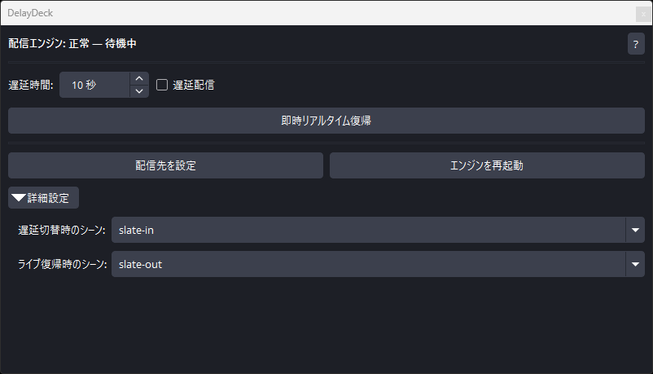

<div align="center">

# DelayDeck

**配信中に切り替えられる、OBS Studio 向け動的配信遅延**

<br>



<sub>DelayDeck Dock — 遅延操作・状態表示・配信先設定</sub>

<br>

[English README](README.en.md)

<br>

[](https://github.com/KatoJunta/DelayDeck/stargazers)
[](https://github.com/KatoJunta/DelayDeck/releases/latest)
[](https://github.com/KatoJunta/DelayDeck/releases)
[](LICENSE)

<br>

[**Download**](https://github.com/KatoJunta/DelayDeck/releases)
&nbsp;·&nbsp;
<a href="#install">導入（ZIP）</a>
&nbsp;·&nbsp;
<a href="#build">ビルド</a>
&nbsp;·&nbsp;
<a href="#faq">Q&amp;A</a>
&nbsp;·&nbsp;
<a href="#roadmap">ロードマップ</a>

</div>

<br>

**DelayDeck** は、OBS Studio の標準機能である「配信遅延」を、より柔軟に使えるようにするプラグインおよび Relay Engine です。

時差のないリアルタイム対戦ゲームを配信する場合、視聴者へ情報が先に届き、配信者が不利になることがあります。標準機能では配信中に遅延の有効/無効を切り替えられないため、配信者はゲームの成績を優先するか、視聴者との交流を優先するかを選ぶ必要がありました。

DelayDeck は、**配信を中断することなく遅延の ON/OFF を切り替えられる**ようにし、ゲームプレイと視聴者との交流の両方を楽しめるようにすることを目的に開発されました。

## 構成

DelayDeck は 2 つのソフトウェアで動きます。

| コンポーネント | 役割 |
| --- | --- |
| **DelayDeck for OBS**（OBS プラグイン） | OBS 内の Dock UI、Relay の起動・監視、配信先設定、配信前チェック |
| **DelayDeck Relay**（配信エンジン） | OBS からの入力受信、遅延バッファ、視聴者向け配信先への送出 |

通常利用時、Relay は OBS 起動時に自動で立ち上がります。配信者が Relay を手動起動する必要はありません。

```text
OBS（エンコード） → ローカル Relay（遅延制御） → YouTube / Twitch など
         ↑
   DelayDeck Dock（操作・状態表示）
```

### 主な機能

| 機能 | 説明 |
| --- | --- |
| **遅延配信 ON/OFF** | 配信中にリアルタイム ↔ 遅延配信を切り替え |
| **スレートシーン** | 遅延切替・ライブ復帰時に視聴者向け画面を表示 |
| **即時リアルタイム復帰** | 未送出コンテンツを破棄してライブへ戻す（Dump Buffer、確認付き） |
| **preflight チェック** | 配信開始前に Relay・配信先・スレート設定を検証 |
| **配信先プリセット** | YouTube / Twitch などの RTMP 先を簡単設定 |

## 動作環境

| 項目 | 内容 |
| --- | --- |
| OS | Windows 10 / 11（64 ビット） |
| OBS Studio | **30.2.3** / **31.1.2** / **32.1.2** のいずれか（ビルドごとに対応 OBS が異なります） |
| アーキテクチャ | x64 |

> **注意:** OBS Studio のバージョンによってプラグインが読み込まれません。**必ず、利用中の OBS バージョンに合った ZIP をダウンロードしてください。**

新しい OBS メジャーバージョンがリリースされたあと、対応ビルドの用意には手動作業が必要です。目的のバージョンが Release にない場合は、[X（@KatoJunta）](https://x.com/KatoJunta) または [GitHub Issues](https://github.com/KatoJunta/DelayDeck/issues) からご連絡ください。

macOS / Linux 向けの配布物は、現時点では提供していません。

---

<a id="install"></a>

## 導入方法（初心者向け・ビルド済みファイルを使う）

パソコン操作に慣れていない方向けの手順です。

### 1. OBS のバージョンを確認する

1. OBS Studio を起動します。
2. メニューから **ヘルプ → OBS について** を開きます。
3. 表示されたバージョン番号（例: `32.1.2`）をメモします。

> **重要:** ダウンロードする ZIP は、OBS のバージョンと一致するものを選んでください。一致しない ZIP を入れると、プラグインが読み込まれないことがあります。

### 2. Release から ZIP をダウンロードする

1. ブラウザで [GitHub Releases](https://github.com/KatoJunta/DelayDeck/releases) を開きます。
2. 使いたいバージョン（例: `v0.1.0`）の Release を選びます。
3. 自分の OBS バージョンに合った ZIP をダウンロードします。

ファイル名の例:

```text
delaydeck-v0.1.0-obs-32.1.2-windows-x64.zip
delaydeck-v0.1.0-obs-31.1.2-windows-x64.zip
delaydeck-v0.1.0-obs-30.2.3-windows-x64.zip
```

`obs-` の後ろが OBS のバージョンです。Release ページに SHA256 が表示されている場合は、ダウンロード後に照合してください。

### 3. OBS を終了する

インストール前に、OBS Studio を完全に終了してください（タスクバーの OBS アイコンも消えていることを確認します）。

### 4. ZIP を OBS のフォルダに展開する

1. OBS のインストール先を開きます。通常は次の場所です。

   ```text
   C:\Program Files\obs-studio
   ```

2. ダウンロードした ZIP を右クリック → **すべて展開**（またはお使いの解凍ソフトで展開）します。

3. 展開された中身（`obs-plugins` フォルダと `data` フォルダ）を、OBS のインストール先フォルダへ **上書きコピー** します。

   ```text
   （ZIP の中身）              （コピー先）
   obs-plugins\64bit\    →    C:\Program Files\obs-studio\obs-plugins\64bit\
   data\obs-plugins\     →    C:\Program Files\obs-studio\data\obs-plugins\
   ```

   `Program Files` への書き込みで権限エラーが出る場合は、エクスプローラーを **管理者として実行** してからコピーしてください。

4. 次のファイルが存在することを確認します。

   - `C:\Program Files\obs-studio\obs-plugins\64bit\delaydeck.dll`
   - `C:\Program Files\obs-studio\obs-plugins\64bit\delaydeck-relay.exe`
   - `C:\Program Files\obs-studio\data\obs-plugins\delaydeck\locale\ja-JP.ini`

### 5. OBS を起動して初期設定を行う

1. OBS を起動します。**DelayDeck** という Dock が表示されます。表示されない場合は、上部メニューの **ドック → DelayDeck** を選んでください。
2. Dock の **配信先を設定** を開き、視聴者向けの配信先（YouTube など）の URL とストリームキーを入力して保存します。
3. 詳細設定で **遅延切替時のシーン** と **ライブ復帰時のシーン** を選びます（遅延 ON/OFF 時に視聴者へ表示するシーンです）。

   > **重要（スレートシーン）:** この 2 つのシーンの音声ミキサーに、**マイク** や **デスクトップ音**（ゲーム音など）を含めないでください。視聴者にリアルタイムの音声がそのまま届き、遅延の意味がなくなります。**BGM だけ** を別途設定するのは問題ありません。

4. OBS の **設定 → 出力 → 配信遅延** が有効になっている場合は **オフ** にしてください。DelayDeck と OBS 標準の配信遅延は同時に使えません。

> **完了:** テスト配信で動作を確認してから、本番配信に使ってください。

---

## OBS の設定方法

通常は、上記の **配信先を設定** だけで十分です。保存すると、OBS の配信先は DelayDeck 用に自動で切り替わります。

手動で確認・設定する場合は、次のとおりです。

### 推奨: DelayDeck の「配信先を設定」を使う

1. DelayDeck Dock の **配信先を設定** を開きます。
2. **配信サイト**（YouTube / Twitch など）を選び、視聴者向けの **配信サーバー URL** と **ストリームキー** を入力します。
3. **保存** を押します。

保存後、OBS の配信設定は次の値に切り替わります。

| 項目 | 値 |
| --- | --- |
| サービス | カスタム… |
| サーバー | `rtmp://127.0.0.1:9401/live` |
| ストリームキー | `stream`（DelayDeck 内部用） |

視聴者向けの URL とストリームキーは Relay 側に保存されます。OBS に表示される localhost 向けのキーは、DelayDeck が Relay へ受け渡すための内部値です。

### 手動で OBS の「配信」設定を開く場合

1. OBS メニューから **設定 → 配信** を開きます。
2. **サービス** を **カスタム…** にします。
3. **サーバー** に `rtmp://127.0.0.1:9401/live` を入力します。
4. **ストリームキー** に `stream` を入力します。
5. **OK** を押して保存します。

視聴者向けの配信先は、OBS ではなく DelayDeck Dock の **配信先を設定** で登録してください。OBS 側だけを手動変更した場合、preflight で配信開始が止まることがあります。

---

<a id="build"></a>

## 導入方法（ソースからビルドする）

開発者向けの手順です。**導入方法（初心者向け・ビルド済みファイルを使う）** で導入済みの場合は、このセクションは読み飛ばして構いません。

### 前提

- Windows 10 / 11（64 ビット）
- [Go](https://go.dev/dl/) 1.24 以降
- [CMake](https://cmake.org/download/) 3.16 以降
- Visual Studio 2022 以降（C++ デスクトップ開発）
- [OBS Studio](https://github.com/obsproject/obs-studio) をソースからビルド済みであること

### 1. リポジトリを取得する

```powershell
git clone https://github.com/KatoJunta/DelayDeck.git
cd DelayDeck
```

### 2. メタデータを同期する

```powershell
.\scripts\dev\sync-repo.ps1
```

### 3. Relay Engine をビルドする

```powershell
cd apps\relay-engine
go build -trimpath -ldflags="-s -w" -o delaydeck-relay.exe ./cmd/delaydeck-relay
cd ..\..
```

### 4. OBS プラグインをビルドする

`ObsStudioDir` には、ビルド済み OBS Studio のソースツリーへのパスを指定します。

```powershell
.\scripts\dev\build-obs-plugin.ps1 -ObsStudioDir "C:\dev\obs-studio"
```

### 5. OBS にインストールする

```powershell
# 既定: C:\Program Files\obs-studio
.\scripts\dev\install-obs-plugin.ps1

# カスタム OBS パス
.\scripts\dev\install-obs-plugin.ps1 -ObsPrefix "C:\path\to\obs-studio"
```

`Program Files` へ書き込む場合は、PowerShell を管理者として実行してください。インストール後、OBS を再起動します。

### CI と同じ ZIP を作る

タグ `v*` を push すると、GitHub Actions が Release 用 ZIP を生成します。手動実行する場合は `.github/workflows/build-windows-zip.yml` の **workflow_dispatch** から、OBS バージョンと Release 公開の有無を指定できます。

---

<a id="faq"></a>

## よくある質問（Q&A）

<details>
<summary><strong>ストリームキーを入力したけど、設定画面に表示されない。保存されていない？</strong></summary>

<br>

**保存されています。** セキュリティのため、ストリームキーは設定画面や OBS のプロファイルに **平文では保存しません**。

Windows では、次の順で保存を試みます。

1. **Windows 資格情報マネージャー**（ターゲット名: `DelayDeck.RelayOutputStreamKey`）
2. 上記が使えない場合は、DelayDeck プラグイン用フォルダ内の **DPAPI 暗号化ファイル**

配信サーバー URL だけは OBS の通常設定として保存されます。ストリームキー本体は OS 側の保護領域に置かれます。DelayDeck のログにもストリームキーは出力しません。

設定をやり直す場合は、Dock の **配信先を設定** から再度入力してください。

</details>

<details>
<summary><strong>ストリームキーの扱いは安全？</strong></summary>

<br>

DelayDeck は、次の方針で機密情報を扱います。

- ストリームキーをログや診断情報に出さない
- Relay との通信には、起動のたびに生成される **セッショントークン** を使う（localhost のみ）
- Relay API は原則 `127.0.0.1` で待ち受け、LAN へ公開しない

ただし、PC 自体への不正アクセスやマルウェアからは、他のアプリと同様に保護できません。PC のセキュリティ更新と、信頼できるソフトウェアのみの利用をおすすめします。

</details>

<details>
<summary><strong>DelayDeck を経由すると、配信や PC のパフォーマンスは落ちる？</strong></summary>

<br>

**多少のオーバーヘッドはありますが、通常は OBS のエンコード負荷の方が大きいです。**

| 処理 | 担当 |
| --- | --- |
| 映像のエンコード | OBS（従来どおり） |
| 遅延バッファと送出タイミング | Relay |
| OBS → Relay | 同一 PC 内の localhost RTMP（`127.0.0.1:9401`） |

localhost 経由のため、ネットワーク帯域への影響は小さいです。一方で、Relay が遅延分のメディアをメモリ上に保持するため、**遅延秒数が長いほどメモリ使用量は増えます**。CPU 使用量も、遅延秒数に応じて増えます。

体感で問題が出る場合は、遅延秒数の見直しや、OBS のエンコード設定（解像度・ビットレート）の調整を検討してください。

</details>

<details>
<summary><strong>Relay を自分で起動する必要はある？</strong></summary>

<br>

**ありません。** OBS 起動時に DelayDeck が Relay を自動起動し、Dock に状態を表示します。Relay が落ちた場合は Dock にエラーが出ます。**エンジンを再起動** ボタンから復旧できます。

</details>

<details>
<summary><strong>OBS の配信先が <code>rtmp://127.0.0.1:9401/live</code> になるのはなぜ？</strong></summary>

<br>

DelayDeck では、OBS は一度ローカルの Relay に送り、Relay が視聴者向けの配信先へ再送出します。これにより、配信中に動的な遅延制御が可能になります。

視聴者向けの URL とストリームキーは **配信先を設定** で Relay に登録します。OBS 側の localhost 用ストリームキーは、DelayDeck 内部用です。

</details>

<details>
<summary><strong>OBS 標準の「配信遅延」と併用できる？</strong></summary>

<br>

**できません。** OBS の配信遅延が有効な状態では、DelayDeck の preflight が配信開始を止めます。DelayDeck を使う場合は、OBS の **設定 → 出力 → 配信遅延** をオフにしてください。

</details>

<details>
<summary><strong>対応 OBS バージョンが合わないとどうなる？</strong></summary>

<br>

プラグイン DLL は OBS の API バージョンにリンクされます。Release 名の `obs-XX.X.X` と、インストール済み OBS のバージョンが一致しない場合、プラグインが読み込まれない、または OBS 起動時にエラーになることがあります。**必ず一致する ZIP を選んでください。**

</details>

<details>
<summary><strong>アンインストール方法は？</strong></summary>

<br>

1. OBS を終了する。
2. 次のファイルを削除する。
   - `obs-plugins\64bit\delaydeck.dll`
   - `obs-plugins\64bit\delaydeck-relay.exe`
   - `data\obs-plugins\delaydeck\` フォルダ一式
3. ストリームキーも削除する場合は、Windows の **資格情報マネージャー** で `DelayDeck` 関連の項目を削除する。
4. OBS の配信先を、元の配信プラットフォーム向け URL に戻す。

</details>

---

## 協力のお願い

v0.1.0 時点では、**数時間以上の長時間配信** について、開発環境での十分な検証ができていません。

DelayDeck を使って **長時間の配信（目安: 2 時間以上）** に成功した場合は、ぜひ開発者へご連絡ください。

| 連絡先 | 向いている報告 |
| --- | --- |
| [X（@KatoJunta）](https://x.com/KatoJunta) | 気軽な成功報告 |
| [GitHub Issues](https://github.com/KatoJunta/DelayDeck/issues) | 詳細な報告、公開での記録 |

次の情報があると助かります。

- OBS Studio のバージョン
- DelayDeck のバージョン（Release 名）
- 配信時間、遅延秒数、解像度・ビットレート（分かる範囲で）
- 問題がなければその旨、不具合があれば症状

報告は、今後の安定性改善と Release ノートの更新に役立てます。

---

<a id="roadmap"></a>

## ロードマップ

現時点で **未実装** の、今後対応を検討している項目です。優先順位や時期は未定です。

| 項目 | 概要 |
| --- | --- |
| **Linux 対応** | OBS プラグインと Relay Engine の Linux 向けビルド・配布 |
| **macOS 対応** | OBS プラグインと Relay Engine の macOS 向けビルド・配布 |
| **マルチストリーム** | 1 本の Relay 入力から、複数の配信サイトへ同時送出 |
| **長時間安定性の検証** | 実際の配信環境での長時間テストと結果の反映 |

GitHub Issues や [X（@KatoJunta）](https://x.com/KatoJunta) への要望・協力も歓迎します。

---

<div align="center">

## ライセンス

[MIT License](LICENSE)

## 関連リンク

[GitHub Releases](https://github.com/KatoJunta/DelayDeck/releases)
&nbsp;·&nbsp;
[GitHub Issues](https://github.com/KatoJunta/DelayDeck/issues)
&nbsp;·&nbsp;
[X（@KatoJunta）](https://x.com/KatoJunta)
&nbsp;·&nbsp;
[English README](README.en.md)

</div>
